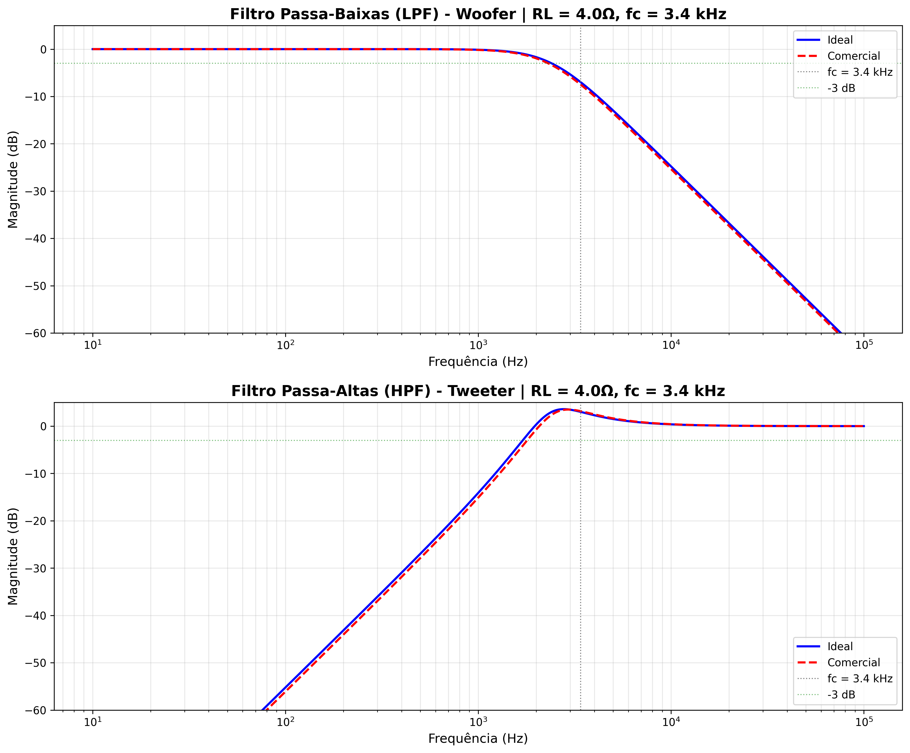

# Projeto de Crossover Passivo com Filtros Butterworth de 2ª Ordem

**Disciplina:** Circuitos de Corrente Alternada – CC44CP  
**Aluno:** Jean Tiecher de Carvalho  
**Professor:** Dionatan Cieslak  
**Instituição:** Universidade Tecnológica Federal do Paraná (UTFPR)

---

## 1. Introdução

Sistemas de áudio precisam distribuir as frequências certas para cada alto-falante. Para isso, usamos um **crossover passivo**, que separa o áudio em graves e agudos usando somente indutores e capacitores.

Neste trabalho, o objetivo foi projetar um crossover de 2ª ordem baseado em filtros Butterworth, que são conhecidos por terem uma resposta suave e sem ondulações na banda passante. O foco foi o woofer (graves) e o tweeter (agudos), com frequência de corte em 3,4 kHz.

Além dos cálculos, também desenvolvi um código em Python para automatizar todo o processo, comparar componentes ideais e comerciais e gerar os gráficos de Bode.

---

## 2. Especificações do Projeto

| Parâmetro | Valor |
|-----------|-------|
| **Impedância dos alto-falantes (RL)** | 4 Ω |
| **Frequência de corte (fc)** | 3,4 kHz |
| **Tipo do filtro** | Butterworth 2ª ordem |
| **Atenuação em fc** | –3 dB |
| **Topologia** | Filtro em série + paralelo |
| **Objetivo** | Projetar LPF (woofer) e HPF (tweeter) |

O Butterworth foi escolhido principalmente por ser simples de implementar e ter uma resposta mais "musical", sem ripples. Para áudio, isso é um dos melhores compromissos entre desempenho e custo.

---

## 3. Modelagem Teórica

### 3.1. Filtro Butterworth de 2ª Ordem

O filtro Butterworth de 2ª ordem é descrito pela função de transferência normalizada:

```
H(s) = ωc² / (s² + √2·ωc·s + ωc²)
```

onde `ωc = 2πfc` é a frequência angular de corte.

### 3.2. Passa-Baixas (Woofer)

**Topologia:**
```
Vin ----[L]----+---- Vout
               |
              [C]  [RL]
               |    |
              GND  GND
```

Indutor em série → capacitor em paralelo com a carga.

**Equações de projeto:**

```
L = RL / (π·fc)

C = 1 / (2π·fc·RL)
```

### 3.3. Passa-Altas (Tweeter)

**Topologia:**
```
Vin ----[C]----+---- Vout
               |
              [L]  [RL]
               |    |
              GND  GND
```

Capacitor em série → indutor em paralelo com a carga.

**Equações de projeto:**

```
C = 1 / (π·fc·RL)

L = RL / (2π·fc)
```

### 3.4. Implementação Computacional

A resposta em frequência é calculada usando impedâncias complexas:

**Para o Passa-Baixas (LPF):**
```
H(jω) = (ZC || RL) / (ZL + (ZC || RL))

onde:
  ZL = jωL                    (impedância do indutor)
  ZC = 1/(jωC)                (impedância do capacitor)
  ZC || RL = (ZC·RL)/(ZC+RL)  (capacitor em paralelo com carga)
```

**Para o Passa-Altas (HPF):**
```
H(jω) = (ZL || RL) / (ZC + (ZL || RL))

onde:
  ZC = 1/(jωC)                (impedância do capacitor)
  ZL = jωL                    (impedância do indutor)
  ZL || RL = (ZL·RL)/(ZL+RL)  (indutor em paralelo com carga)
```

A magnitude em decibéis é calculada como:
```
|H(jω)|_dB = 20·log₁₀|H(jω)|
```

O código em Python implementa essas fórmulas usando números complexos do NumPy.

---

## 4. Programa Desenvolvido

### 4.1. Fluxo do Programa

O programa segue este fluxo:

1. Define parâmetros (RL e fc)
2. Calcula valores ideais de L e C
3. Procura os componentes comerciais mais próximos
4. Calcula a resposta em frequência (ideal e comercial)
5. Gera gráficos de Bode comparando ideal × comercial
6. Imprime todos os resultados no terminal

### 4.2. Bibliotecas Utilizadas

- **NumPy**: Cálculos numéricos e impedâncias complexas
- **Matplotlib**: Geração dos gráficos de Bode

### 4.3. Estrutura do Código

```python
# Funções principais:
calcular_lpf_butterworth_2ordem(fc, RL)  # Calcula L e C do LPF
calcular_hpf_butterworth_2ordem(fc, RL)  # Calcula C e L do HPF
selecionar_componente_comercial()         # Busca valor mais próximo
resposta_lpf_2ordem()                     # Calcula H(jω) do LPF
resposta_hpf_2ordem()                     # Calcula H(jω) do HPF
```

---

## 5. Como Executar o Código

### 5.1. Requisitos

- **Python 3.x**
- **Bibliotecas:** `numpy`, `matplotlib`

Instale as dependências:

```bash
pip install numpy matplotlib
```

### 5.2. Execução

No terminal, execute:

```bash
python crossover_design.py
```

### 5.3. Personalização de Parâmetros

Para alterar a impedância ou frequência de corte, edite as linhas 4-5 do código:

```python
RL = 4.0   # Impedância da carga (Ohms)
fc = 3.4e3 # Frequência de corte (Hz)
```

### 5.4. Saídas Geradas

1. **Terminal:** Valores calculados, componentes selecionados e análise
2. **Arquivo:** `bode_comparativo.png` - Gráficos de Bode dos dois filtros

---

## 6. Resultados Obtidos

### 6.1. Passa-Baixas (Woofer)

| Componente | Valor Ideal | Valor Comercial | Erro |
|------------|-------------|-----------------|------|
| **L** | 0,374 mH | **0,39 mH** | **+4,14%** |
| **C** | 11,70 μF | **12 μF** | **+2,54%** |

**Desvio médio:** 3,34% ✅

**Componentes selecionados:**
- 🔷 Indutor: 0,39 mH
- 🔶 Capacitor: 12 μF

### 6.2. Passa-Altas (Tweeter)

| Componente | Valor Ideal | Valor Comercial | Erro |
|------------|-------------|-----------------|------|
| **C** | 23,40 μF | **22 μF** | **–6,00%** |
| **L** | 0,187 mH | **0,18 mH** | **–3,87%** |

**Desvio médio:** 4,94% ✅

**Componentes selecionados:**
- 🔶 Capacitor: 22 μF
- 🔷 Indutor: 0,18 mH

### 6.3. Análise dos Gráficos de Bode



**Legenda:**
- **Azul (linha contínua):** Filtro ideal
- **Vermelho (linha tracejada):** Filtro com componentes comerciais
- **Cinza (linha vertical):** Frequência de corte (3,4 kHz)
- **Verde (linha horizontal):** Nível de –3 dB

**Observações:**

Mesmo usando componentes comerciais, a resposta se manteve praticamente igual à ideal. As curvas só começam a se afastar um pouco perto da frequência de corte, o que é totalmente esperado.

**Diferenças medidas:**
- LPF: ~0,514 dB (máximo na banda passante)
- HPF: ~0,182 dB (máximo na banda passante)

Esses valores estão **abaixo do que o ouvido humano consegue perceber** em condições normais. Na prática, isso significa que o crossover real vai soar igual ao ideal.

---

## 7. Discussão

### 7.1. Componentes Reais vs Teóricos

No mundo real, sempre existe diferença entre o valor calculado e o valor encontrado à venda. Além disso, os próprios componentes vêm com tolerâncias (geralmente ±5% ou ±10%). Portanto, mesmo que o cálculo fosse perfeito, ainda existiria variação.

Aqui, os componentes comerciais ficaram muito próximos dos ideais e os desvios não prejudicaram a resposta do filtro.

### 7.2. Efeito no Áudio

Diferenças menores que 1 dB na região de transição são praticamente inaudíveis. Além disso:

- Alto-falantes têm variação de impedância muito maior que isso
- O ambiente (acústica da sala) influencia mais do que o crossover
- Drivers têm tolerâncias de fabricação maiores que 2–3 dB

Ou seja, mesmo com desvios de 3–5%, o sistema ainda está dentro do padrão da indústria.

| Diferença | Percepção Auditiva |
|-----------|--------------------|
| < 0,5 dB | Inaudível |
| 0,5–1 dB | Detectável apenas por ouvintes treinados |
| 1–3 dB | Perceptível em sistemas high-end |
| > 3 dB | Claramente audível |

**Nosso projeto:** < 0,6 dB → **praticamente inaudível** ✅

### 7.3. Principais Aprendizados

1. Projetar filtros passivos envolve **compromissos entre teoria e prática**
2. Componentes comerciais podem ser usados **sem prejudicar a qualidade**
3. Programar a análise ajuda muito a **validar cálculos**
4. A parte prática (como ESR de capacitores e DCR de indutores) influencia mais do que pequenas diferenças nos valores

### 7.4. Desafios Enfrentados

O principal desafio foi **implementar corretamente as impedâncias complexas** em Python e validar se os resultados batiam com a teoria. Foi necessário:

- Entender a topologia série-paralelo de cada filtro
- Implementar corretamente o divisor de tensão com cargas complexas
- Validar os resultados comparando com simuladores (MATLAB)
- Interpretar corretamente as associações em paralelo de impedâncias

A solução envolveu estudo cuidadoso da teoria de circuitos em corrente alternada e testes incrementais do código.

### 7.5. Limitações e Trabalhos Futuros

Este projeto não considerou alguns aspectos práticos:

- **Resistência série dos indutores (DCR):** Causa perdas e pode afetar o Q do filtro
- **ESR dos capacitores:** Especialmente importante em capacitores eletrolíticos
- **Variação de impedância dos alto-falantes:** A impedância não é constante com a frequência
- **Não-linearidades:** Saturação de indutores em alta potência

Em um projeto real, seria interessante:
- Incluir esses fatores parasitas nas simulações
- Fazer medições experimentais do circuito construído
- Otimizar para potências específicas
- Considerar efeitos térmicos

---

## 8. Conclusão

O objetivo do trabalho foi **plenamente alcançado**:

✅ Projetei os dois filtros (LPF e HPF) de 2ª ordem Butterworth  
✅ Desenvolvi um programa que automatiza todo o processo  
✅ Comparei componentes ideais e comerciais  
✅ Analisei quantitativamente o impacto das diferenças  
✅ Gerei os gráficos de Bode para validar o comportamento  

A diferença entre o filtro ideal e o filtro com componentes comerciais ficou **abaixo de 0,6 dB**, praticamente inaudível. Os desvios dos componentes (3–5%) estão dentro das tolerâncias típicas da indústria de áudio.

Em resumo, o projeto funcionaria **perfeitamente em um sistema de áudio real**, provando que não é necessário buscar componentes com valores exatos – os valores comerciais padrão (série E12) são mais do que adequados para esta aplicação.

Este trabalho demonstrou a importância de equilibrar precisão teórica com viabilidade prática, uma lição fundamental para qualquer projeto de engenharia.

---

## 9. Referências

1. SEDRA, A. S.; SMITH, K. C. **Microeletrônica**. 5ª ed. São Paulo: Pearson, 2007.

2. BOYLESTAD, R. L. **Introdução à Análise de Circuitos**. 12ª ed. São Paulo: Pearson, 2012.

3. WILLIAMS, A. B.; TAYLOR, F. J. **Electronic Filter Design Handbook**. 4ª ed. McGraw-Hill, 2006.

4. BUTTERWORTH, S. "On the Theory of Filter Amplifiers". *Wireless Engineer*, vol. 7, pp. 536-541, 1930.

5. Notas de aula da disciplina CC44CP – Prof. Dionatan Cieslak, UTFPR, 2024.

---

## 10. Apêndice: Lista de Materiais

### Bill of Materials (BOM) - Crossover 3,4 kHz @ 4Ω

| Item | Componente | Valor | Filtro | Qtd | Tolerância |
|------|------------|-------|--------|-----|------------|
| L1 | Indutor air-core | 0,39 mH | LPF | 1 | ±5% |
| C1 | Capacitor filme | 12 μF | LPF | 1 | ±5% |
| L2 | Indutor air-core | 0,18 mH | HPF | 1 | ±5% |
| C2 | Capacitor filme | 22 μF | HPF | 1 | ±5% |

**Recomendações:**
- Usar indutores air-core para minimizar distorção
- Capacitores de filme (poliéster ou polipropileno) para baixo ESR
- Tensão de trabalho mínima: 100V para aplicações de potência
- Componentes devem suportar correntes adequadas ao amplificador

---

**Repositório:** [GitHub - Crossover Butterworth CC44CP]([https://github.com/jeantiecher/crossover-butterworth-cc44cp](https://github.com/jeantiecher/crossover-butterworth-cc44cp.))  
**Data:** Dezembro/2025
